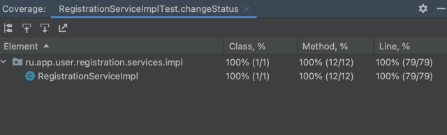

# Сервис:  Регистрация пользователей и учета

Версия: 1.0

Спецификация сервиса реализована по средствам SWAGGER-UI
#### SWAGGER-UI-LINK: http://localhost:8080/swagger-ui/index.html#/

### Переменные окружения

| Переменная окружения       | Пример значения                                    | Описание                                 |
|----------------------------|----------------------------------------------------|------------------------------------------|
| spring.datasource.jdbc.url | jdbc:postgresql://localhost:5432/user_registration | JDBC строка подключения к PG             |
| spring.datasource.username | postgres                                           | Имя пользователя для подключения к БД    |
| spring.datasource.password | postgres                                           | Пароль пользователя для подключения к БД | 

### Тестирование

    Тестирования выполнено по средствам JUnit и Mockito

#### Результаты теста   

### Docker
    
    В корне проекта создан Docker файл, по средствам которого можно создать образ проекта.
